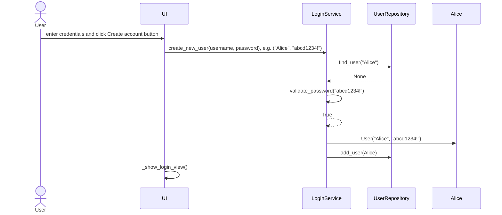
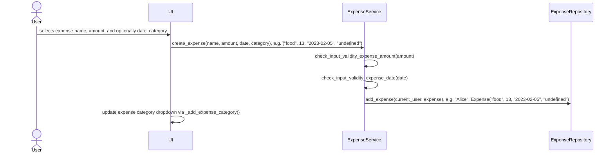
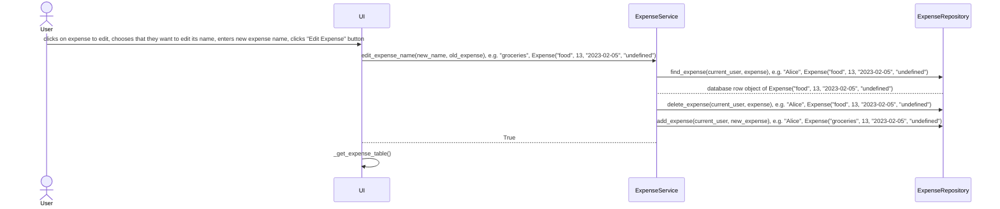

# Architecture of the Application

## Structure

The structure of the application follows a three-level layer architecture, and can be seen here represented as a package diagram:

INSERT DIAGRAM

## User Interface

The user interface contains six different views:
- Login
- Creating a new account
- Expense tracker home screen
- Expense creation (create new expenses)
- Expense overview (to view expense tables and edit expenses)
- Expense graph view (view expenses as graphs)

Each view is implemented as its own class and only one of them is visible to the user at a time. The UI class handles the interaction between the different views (e.g. switching from one to the other, closing the first and displaying the second). The view classes are separated from the application logic as much as possible, and they call methods from both the ExpenseService and LoginService class. By repeatedly calling such methods, the data displayed in the UI is kept up-to-date with changes made by the user in the UI - for example, if a user edits an expense name, the expense table is updated using the list_all_expenses() method of the ExpenseService class, and it then shows the expense with the new name. 

## Application Logic
The logical data model of the application is made up of the classes User, Expense and Category, which describe the application's users, their expenses, and the categories of those expenses:

INSERT DIAGRAM

The classes responsible for application logic are ExpenseService and LoginService. Methods offered by this class are used to manage the logic behind user's interaction with the user interface, and include
- create_new_user(username, password)
- create_expense(name, amount, date, category)
- rename_category(new_category_name, category)
- list_all_expenses()

The LoginService class uses the UserRepository class to access the user data (usernames, passwords), and the ExpenseService class uses the ExpenseRepository class to access data about users and their expenses.

The relationship between the classes of the application logic is specified further in the following packaging diagram:

## Permanent storage of data
The UserRepository classes and the ExpenseRepository classes handle data storage and retrieval. Both classes use an SQLite database, which contains two tables.

The *users* table contains information on usernames and passwords, and the *expenses* table contains data about the expenses associated with users. The details of how data storage is handled is contained only within the repository classes, and thus separate from further application logic.

The database_initialization file handles the creation of the SQLite database and its tables.
The .env configuration file at the root of the application's repository handles the naming of the database file.

## Main Functionalities

### Creating a User 

The user first chooses and enters their desired username and password, and then clicks "Create account and continue to login" if they want to create an account with those credentials. The following sequence diagram describes the process of user creation in application logic.

Once the user has entered a username and password and clicked the "Create account and continue to login" button, the UI calls the create_new_user method of the LoginService class in application logic, giving the selected username and password as parameters. The LoginService then checks via UserRepository if a user with the same username already exists. If a user with the same username is found, LoginService raises an error, which the UI then displays to the user (this is not shown in the above diagram). If not, it returns None. In that case, LoginService then uses its own function, validate_password, to check that the user's chosen password meets the criteria of being minimum 8 characters long, containing at least one number and one special character. If the password does not meet one of the conditions, an error is raised and displayed to the user. If the password is valid, the function returns True. Login Service then creates a User object with the chosen credentials and adds it to the database via UserRepository. If no errors have occurred, everything went well and the UI displays the Login view to the user.

### Logging in

Logging in a user functions very similarly to creating a user, hence no additional sequence diagram is necessary to understand it. The user enters their username and password, and then clicks the "Login" button. The UI then calls the login_user method of the LoginService class, giving the selected username and password as parameters. The LoginService then uses the validate_credentials function to check via UserRepository if a user with the entered username exists, and if that user's password in the database matches the entered one. If the entered credentials are invalid, an error message will be displayed in the UI. If the entered credentials are valid, the logged_in_user attribute of the LoginSevice class is updated to a user object with the user's username and password. Then, the UI view is changed to the expense tracker homescreen, created by the ExpenseOverview class.

### Create new expense
To create a new expense, a user must enter at least the expense name and amount. They can also choose to enter the expense date and category. The expense is then created by clicking *Create new expense*.

The following sequence diagram describes how the expense is created in application logic.

If no expense date and category are entered, the expense will be entered under the current date and placed in the category "undefined". 
The amount must be a nonnegative numeric value, and an entered date must be a valid date in YYYY-MM-DD format. Otherwise, an error message will be displayed to the user.

### Edit expenses and categories
In the UI, the user can edit and delete previously created expenses and categories, via the ExpenseOverview class. 

The following sequence diagram shows the process of editing the name of an expense.

Editing other aspect of expenses, deleting expenses, editing categories and deleting them follow a very similar structure. When editing and deleting categories, the process is repeated for all expenses that can be found in the database within that category.

### View expense tables and graphs
In the UI, the user can choose to view all expenses as a table or as a graph, or to choose a category and then view expenses within that category as a table or as a graph.

For viewing expenses as a table, the UI calls the list_all_expenses or list_expenses_by category of the ExpenseService class. The latter method takes the chosen category as a parameter. The method then returns a list of expenses (either all expenses, or the expenses of the chosen category) of the logged-in user via the ExpenseRepository.

For viewing expenses as a graph, the UI calls the graph_all_expenses or graph_expenses_by_category method of the ExpenseService class. The latter method takes the chosen category as a parameter. The method then plots all relevant expenses using a pandas dataframe, gotten via the get_all_expenses_as_pandas_dataframe method of the ExpenseRepository class.
