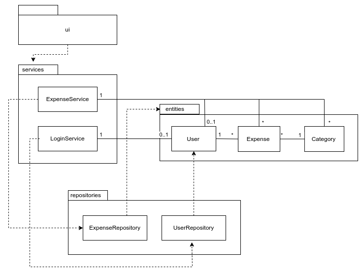
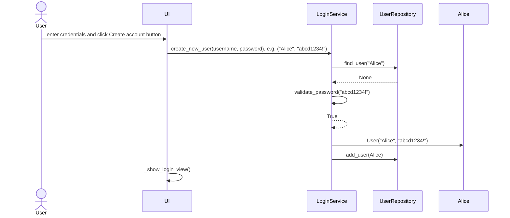

# Architecture of the Application

## Structure

The structure of the application represented as a package diagram:

## Application Logic

### Creating a User 

The user first chooses and enters their desired username and password, and then clicks "Create account and continue to login" if they want to create an account with those credentials. The following sequence diagram describes the process of user creation in application logic.

Once the user has entered a username and password and click the "Create account and continue to login" button, the UI calls the create_new_user method of the LoginService class in application logic, giving the selected username and password as parameters. The LoginService then checks via UserRepository if a user with the same username already exists. If a user with the same username is found, LoginService raises an error, which the UI then displays to the user (this is not shown in the above diagram). If not, it returns None. In that case, LoginService then uses its own function, validate_password, to check that the user's chosen password meets the criteria of being minimum 8 characters long, containing at least one number and one special character. If the password does not meet one of the conditions, an error is raised and displayed to the user. If the password is valid, the function returns True. Login Service then creates a User object with the chosen credentials and adds it to the database via UserRepository. If no errors have occurred, everything went well and the UI displays the Login view to the user.
