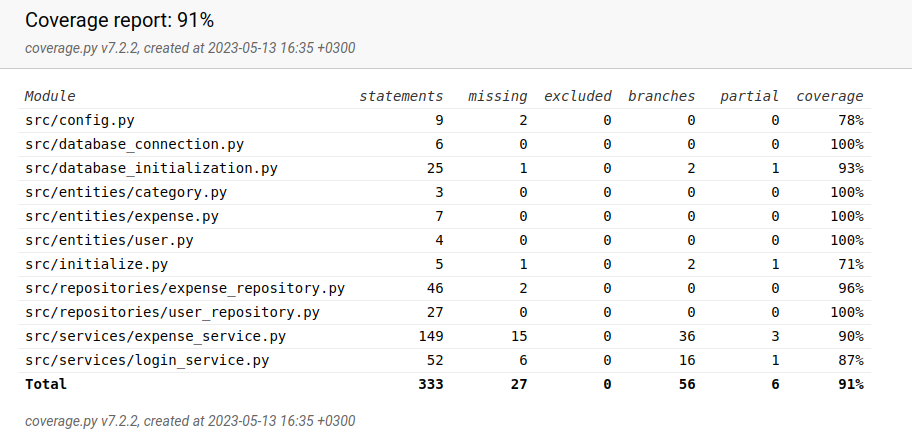

# Testing Document

The application has been tested with automated unit and integration tests, using unittest, as well as manually using system testing.

## Unit and Integration Tests

### Application Logic
The application logic classes, `ExpenseService` and `LoginService`, are tested using the `TestExpenseService` and `TestLoginService` respectively. The `TestExpenseService` class uses a newly initialized `ExpenseRepository` and the `TestLoginService` class a new `UserRepository`, which each interact with a newly created database specifically created for testing, at the time of testing

### Repositories
The `UserRepository` class is tested using the `TestUserRepository` class, and the `ExpenseRepository` class is tested using the `TestExpenseRepository` class. Each of these interacts with a newly created SQLite database specifically created for testing, at the time of testing. The name of the test database file is set in the .env.test file at the root of the application.

### Test coverage

The test coverage of the application, excluding the user interface, is 91%

## System Tests

System testing of the application was performed manually.

### Installation and configuration

The application has been downloaded, installed, run and tested using the instructions in README and user manual in a Linux environment. This has been done using different configurations in the .env file. Moreover, manual testing was done when the application was newly installed, and the database file did not exist beforehand, and when the application was already installed and the file existed before testing.

### Functionalities

All functionalities described in the specification document and the user manual have been manually tested. This includes using invalid inputs to the text fields, and incomplete selections of dropdown menus.

### Quality problems left in the application
- The application logic tests assume that previous, extensive testing of the repository classes has been done. Since the repository classes are not very large, this did not prove to be an issue so far, but if they were to be significantly extended, testing of service classes might need to be implemented separately without relying on repository functionality. 
- No specific error message has been defined in the case that `poetry run invoke start` is run without following the instructions and running `poetry run invoke initialize` beforehand.

