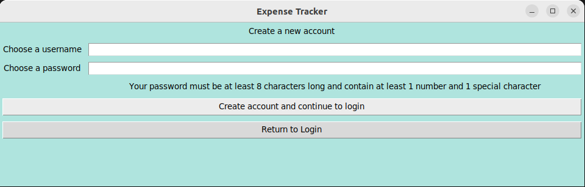
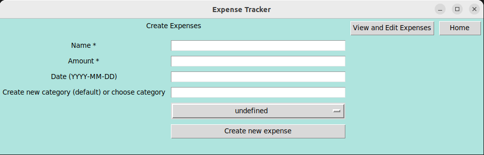

# User Manual

## Starting the application

1. Install dependencies through command line using:

```bash
poetry install
```

2. Perform necessary initialization using:

```bash
poetry run invoke initialize
```

3. Start the application using: 

```bash
poetry run invoke start
```

## Login
Once starting the application, the login view is initially displayed.


If you already have an account, you can log in by entering your username and password, and clicking the *Login* button.
If you do not yet have an account, you first need to create one. You can do this after clicking the *Create new account* button.

## Creating a new user
Once clicking the *Create new account* button, you see the following screen.


You can create an account by entering your chosen username and password, and clicking the *Create account and return to Login* button The password must be at least 8 characters long and contain at least 1 number and 1 special character of the following: !"#$%&'()*+,-/:;<=>?@[\]^_`{|}~.

If the account was successfully created, you will return to the Login View, and you will need to enter your details there to go to the expense tracker itself.
Otherwise, you will get an error message explaining the issue as a popup. You can close it by clicking the *OK* button, or the 'x' in the top right corner, and then fix the issue and try creating the account again.

If you do not want to create an account, you can return to login by clicking the *Return to Login* button.

## Expense Tracker Home 
After logging in successfully, you will be taken to the Expense Tracker Home screen.


From here, you can choose to create new expenses by clicking the *Create Expenses* button.
You can also choose to view and edit your previously created expenses by clicking the *View and Edit Expenses* button. Most of that functionality is available only after you have created at least one expense.

You can also log out from the expense tracker by clicking the *Log out* button in the top right corner. This will take you back to the Login view.

## Create Expenses View
After clicking the *Create Expenses* button, you will see the following screen.



To create a new expense, you must enter at least the expense name and amount. The amount must be a nonnegative numeric value, otherwise you will get a popup informing you of this, and your expense will not be created until you change the amount.

You can also choose to enter the expense date and category. If you do not enter anything, the expense will be entered under the current date and placed in the category "undefined". If you enter a date, it must be a valid date in YYYY-MM-DD format. For category, you can enter a category name into the text field. This creates a new category. Instead of that, you could also choose from your previously created categories by clicking on the dropdown menu (where it says undefined in the picture). 

Once you have entered all desired information, you can create the expense by clicking *Create new expense*.
You can return to the expense tracker homescreen by clicking *Home* in the top right corner.
You can also go to *View and Edit Expenses* by clicking the button with the same name.

## View and Edit Expenses View

After clicking the *View and Edit Expenses* button, you will see the following view:


You can see a total of all entered expenses at the top left. Below that, the button *View all expenses as table* displays all entered expenses in a table, as shown in the picture. If a lot of expenses have been entered, you can navigate through them with the scrollbar on the right of the table. 

You can also choose to *View expenses by category as table*. Before clicking that button, you need to select the category from the dropdown below the button.

Below the table, you can edit and delete your expenses and categories.
To edit or delete an expense, you need to first click on the expense. It will then turn blue, as shown in the picture. Then, you need to select what you want to edit (e.g. expense name, amount, date or category), or if you want to delete the expense from the dropdown. If you want to edit, you also need to fill in the new value (e.g. the new name) in the text field. Once all that is done, you click *Edit Expense*. 

To edit or delete a category, you choose the relevant category from the dropdown menu. If you want to delete it, you click the button *Delete Category*. Deleting a category does not delete all expenses in that category, but moves all of them to the "undefined" category. That category cannot be deleted. If you want to edit your selected category, you also need to enter the new category name in the text field, and then click *Edit Category*.

From this screen, you can navigate to view graph representations of your expenses via the *View expenses as graph* button on the top right. 
You can also return to the expense tracker home screen by clicking the *Home* button on the top right.

## Expense Graph View

After clicking the *View expenses as graph* button on the "View and Edit Expenses" screen, you reach the "Expense Graph View". After clicking on the *View graph for all expenses button*, a graph like the one in the picture will be displayed:


You can also view a graphical representation of your spending history in a certiain category, by choosing a category from the dropdown menu in the middle of the screen, and then clicking the *View graph for expenses by category* button.

You can return to the expense tracker home screen by clicking the *Home* button on the top right.
