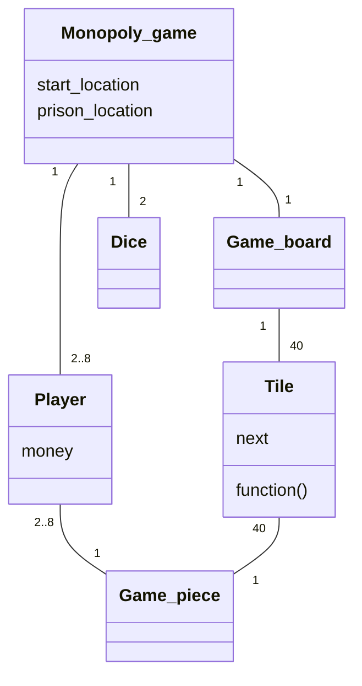

---

Monopoly
---

```mermaid
  classDiagram
    Monopoly_game "1" -- "1" Game_board
      class Monopoly_game{
        start_location
        prison_location
      }
      class Game_board{
      }
    Monopoly_game "1" -- "2" Dice
      class Dice{
      }
    Monopoly_game "1" -- "2..8" Player
      class Player{
        money
      }
    Game_board "1" -- "40" Tile
      class Tile{
        next
        function()
      }
    Player "2..8" -- "1" Game_piece
      class Game_piece{
      }
    Tile "40" -- "1" Game_piece
```
