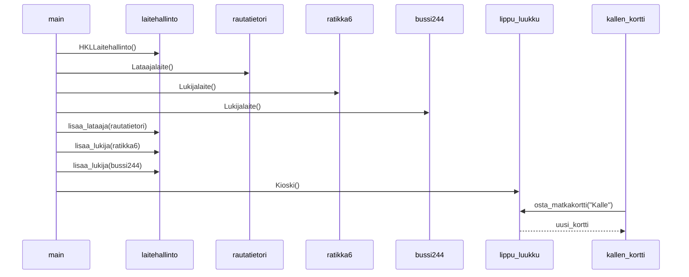

```mermaid
  sequenceDiagram
  main->>laitehallinto: HKLLaitehallinto()
  main->>rautatietori: Lataajalaite()
  main->>ratikka6: Lukijalaite()
  main->>bussi244: Lukijalaite()
  main->>laitehallinto: lisaa_lataaja(rautatietori)
  main->>laitehallinto: lisaa_lukija(ratikka6)
  main->>laitehallinto: lisaa_lukija(bussi244)
  main->>lippu_luukku: Kioski()
  kallen_kortti->>lippu_luukku: osta_matkakortti("Kalle")
  lippu_luukku-->>kallen_kortti: uusi_kortti
  
```
